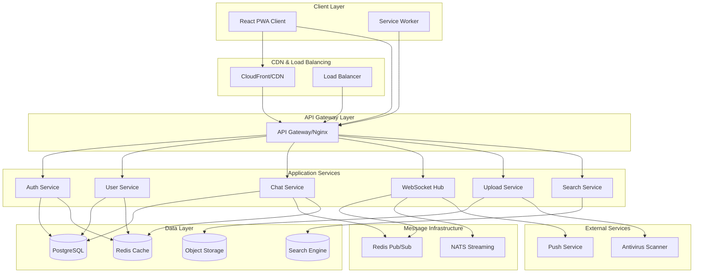

# Design Document

## Overview

The Telegram-like web chat application will be built as a modern, scalable real-time messaging platform using a microservices architecture. The system consists of a React PWA frontend communicating with a Node.js/TypeScript backend through REST APIs and WebSocket connections. The architecture prioritizes performance, security, and horizontal scalability to meet the demanding requirements of sub-second message delivery and high concurrent user loads.

## Architecture

### High-Level System Architecture



### Technology Stack

**Frontend:**
- React 18 with TypeScript
- Vite for build tooling
- React Router for navigation
- React Query for server state management
- Zustand for client state management
- Tailwind CSS + Radix UI for styling
- Socket.IO client for WebSocket communication

**Backend:**
- Node.js 20 LTS with TypeScript
- NestJS framework for structure and DI
- Socket.IO for WebSocket handling
- Prisma ORM for database operations
- Zod for validation
- JWT for authentication

**Infrastructure:**
- PostgreSQL for primary data storage
- Redis for caching and pub/sub
- NATS for message streaming
- S3-compatible object storage
- MeiliSearch for full-text search
- Docker containers with Kubernetes orchestration

## Components and Interfaces

### Authentication Service

**Responsibilities:**
- User registration and login
- JWT token generation and validation
- Session management across devices
- 2FA (TOTP) implementation
- Password reset flows

**Key Interfaces:**
```typescript
interface AuthService {
  register(email: string, password: string): Promise<AuthResult>
  login(email: string, password: string): Promise<AuthResult>
  refreshToken(refreshToken: string): Promise<TokenPair>
  logout(sessionId: string): Promise<void>
  enable2FA(userId: string): Promise<TwoFactorSetup>
  verify2FA(userId: string, token: string): Promise<boolean>
}

interface AuthResult {
  user: User
  accessToken: string
  refreshToken: string
  expiresIn: number
}
```

### User Service

**Responsibilities:**
- User profile management
- Contact management (add, accept, block)
- Privacy settings
- User search and discovery

**Key Interfaces:**
```typescript
interface UserService {
  getProfile(userId: string): Promise<UserProfile>
  updateProfile(userId: string, updates: ProfileUpdate): Promise<UserProfile>
  addContact(userId: string, username: string): Promise<ContactRequest>
  acceptContact(requestId: string): Promise<Contact>
  blockUser(userId: string, targetUserId: string): Promise<void>
  searchUsers(query: string): Promise<User[]>
}
```

### Chat Service

**Responsibilities:**
- Conversation management (DM, groups)
- Message persistence and retrieval
- Message editing and deletion
- Read receipts and delivery states
- Conversation member management

**Key Interfaces:**
```typescript
interface ChatService {
  createConversation(type: ConversationType, participants: string[]): Promise<Conversation>
  getConversations(userId: string, cursor?: string): Promise<ConversationList>
  getMessages(conversationId: string, before?: string, limit?: number): Promise<MessageList>
  sendMessage(message: MessageInput): Promise<Message>
  editMessage(messageId: string, content: string): Promise<Message>
  deleteMessage(messageId: string): Promise<void>
  markAsRead(conversationId: string, messageId: string, userId: string): Promise<void>
}
```

### WebSocket Hub

**Responsibilities:**
- Real-time connection management
- Message broadcasting
- Presence tracking
- Typing indicators
- Room-based message distribution

**Key Events:**
```typescript
// Client to Server
interface ClientEvents {
  'auth': (token: string) => void
  'join-room': (conversationId: string) => void
  'leave-room': (conversationId: string) => void
  'send-message': (message: MessageInput) => void
  'typing-start': (conversationId: string) => void
  'typing-stop': (conversationId: string) => void
  'presence-update': (status: PresenceStatus) => void
}

// Server to Client
interface ServerEvents {
  'message-new': (message: Message) => void
  'message-ack': (tempId: string, messageId: string) => void
  'message-edited': (message: Message) => void
  'message-deleted': (messageId: string) => void
  'typing': (userId: string, conversationId: string) => void
  'presence': (userId: string, status: PresenceStatus) => void
  'receipt': (messageId: string, userId: string, type: ReceiptType) => void
}
```

### Upload Service

**Responsibilities:**
- Presigned URL generation for direct S3 uploads
- File validation and virus scanning
- Thumbnail and preview generation
- Media processing and optimization

**Key Interfaces:**
```typescript
interface UploadService {
  generatePresignedUrl(fileType: string, fileSize: number): Promise<PresignedUpload>
  processUpload(objectKey: string): Promise<ProcessedFile>
  generateThumbnail(objectKey: string): Promise<string>
  scanFile(objectKey: string): Promise<ScanResult>
}
```

### Search Service

**Responsibilities:**
- Message indexing and search
- Contact and conversation search
- Search result ranking and filtering

**Key Interfaces:**
```typescript
interface SearchService {
  indexMessage(message: Message): Promise<void>
  searchMessages(query: string, filters: SearchFilters): Promise<SearchResult[]>
  searchContacts(query: string, userId: string): Promise<User[]>
  searchConversations(query: string, userId: string): Promise<Conversation[]>
}
```

## Data Models

### Core Entities

```typescript
interface User {
  id: string
  username: string
  email: string
  phone?: string
  name: string
  bio?: string
  avatarUrl?: string
  lastSeenAt: Date
  privacySettings: PrivacySettings
  createdAt: Date
}

interface Conversation {
  id: string
  type: 'dm' | 'group' | 'channel'
  title?: string
  avatarUrl?: string
  ownerId?: string
  createdAt: Date
  updatedAt: Date
  members: ConversationMember[]
  lastMessage?: Message
}

interface Message {
  id: string // ULID for time-ordered IDs
  conversationId: string
  senderId: string
  type: 'text' | 'image' | 'video' | 'audio' | 'file' | 'system'
  content: string
  metadata?: MessageMetadata
  replyToId?: string
  attachments: Attachment[]
  createdAt: Date
  editedAt?: Date
  deletedAt?: Date
}

interface Attachment {
  id: string
  messageId: string
  objectKey: string
  mimeType: string
  sizeBytes: number
  width?: number
  height?: number
  durationMs?: number
  thumbnailKey?: string
}
```

### Database Schema Design

**Partitioning Strategy:**
- Messages table partitioned by conversation_id hash for horizontal scaling
- Read replicas for query distribution
- Separate hot/cold storage for message archival

**Indexing Strategy:**
```sql
-- Primary indexes for performance
CREATE INDEX idx_messages_conversation_created ON messages(conversation_id, created_at DESC);
CREATE INDEX idx_conversations_user_updated ON conversation_members(user_id, conversation_id) 
  INCLUDE (joined_at, role);
CREATE INDEX idx_users_username ON users(username) WHERE username IS NOT NULL;
CREATE INDEX idx_users_email ON users(email);

-- Full-text search
CREATE INDEX idx_messages_content_gin ON messages USING gin(to_tsvector('english', content));
```

## Error Handling

### Error Classification

**Client Errors (4xx):**
- 400 Bad Request: Invalid input validation
- 401 Unauthorized: Authentication required
- 403 Forbidden: Insufficient permissions
- 404 Not Found: Resource doesn't exist
- 409 Conflict: Resource state conflict
- 429 Too Many Requests: Rate limit exceeded

**Server Errors (5xx):**
- 500 Internal Server Error: Unexpected server error
- 502 Bad Gateway: Upstream service failure
- 503 Service Unavailable: Service overloaded
- 504 Gateway Timeout: Upstream timeout

### Error Response Format

```typescript
interface ErrorResponse {
  error: {
    code: string
    message: string
    details?: Record<string, any>
    timestamp: string
    requestId: string
  }
}
```

### Retry and Circuit Breaker Patterns

**WebSocket Reconnection:**
- Exponential backoff: 1s, 2s, 4s, 8s, max 30s
- Jitter to prevent thundering herd
- Automatic room re-joining on reconnect

**Service-to-Service Communication:**
- Circuit breaker with 50% failure threshold
- Timeout: 5s for API calls, 30s for uploads
- Retry with exponential backoff for transient failures

## Testing Strategy

### Unit Testing
- Jest for service logic testing
- 90%+ code coverage requirement
- Mock external dependencies (database, Redis, S3)
- Test error conditions and edge cases

### Integration Testing
- Supertest for API endpoint testing
- Test database transactions and rollbacks
- WebSocket event flow testing
- File upload and processing workflows

### End-to-End Testing
- Playwright for browser automation
- Critical user journeys:
  - User registration and login
  - Send/receive messages in DM and group
  - File upload and sharing
  - Real-time features (typing, presence)
  - Cross-device session management

### Performance Testing
- k6 for load testing
- Target metrics:
  - 10,000 concurrent WebSocket connections
  - 500 messages/second throughput
  - P95 message latency < 350ms
  - P95 API response time < 200ms

### Security Testing
- OWASP ZAP for vulnerability scanning
- Penetration testing for authentication flows
- Input validation and injection testing
- Rate limiting effectiveness testing

## Performance Optimizations

### Frontend Optimizations
- Virtual scrolling for message lists (react-window)
- Image lazy loading with intersection observer
- Code splitting by route and feature
- Service worker caching for static assets
- Optimistic UI updates for instant feedback

### Backend Optimizations
- Connection pooling for database (pgbouncer)
- Redis clustering for horizontal scaling
- Message batching for bulk operations
- Prepared statements for frequent queries
- Compression for WebSocket messages

### Caching Strategy
```typescript
// Multi-level caching
interface CacheStrategy {
  // L1: In-memory application cache (Node.js Map)
  applicationCache: Map<string, any>
  
  // L2: Redis distributed cache
  distributedCache: RedisClient
  
  // L3: CDN edge caching
  edgeCache: CloudFrontDistribution
}

// Cache TTL configuration
const CACHE_TTL = {
  userProfile: 300, // 5 minutes
  conversationList: 60, // 1 minute
  messageList: 3600, // 1 hour
  searchResults: 180, // 3 minutes
}
```

### Database Optimizations
- Read replicas for query distribution
- Connection pooling with pgbouncer
- Query optimization with EXPLAIN ANALYZE
- Materialized views for complex aggregations
- Partitioning for large tables (messages, attachments)

## Security Considerations

### Authentication Security
- Argon2id password hashing with unique salts
- JWT access tokens (5-10 minute expiry)
- Refresh token rotation on each use
- Device fingerprinting for anomaly detection
- Progressive login delays for failed attempts

### Data Protection
- TLS 1.3 for all communications
- AES-256 encryption for data at rest
- Encrypted object storage with customer-managed keys
- Secure headers (HSTS, CSP, X-Frame-Options)
- Input sanitization and output encoding

### Rate Limiting
```typescript
interface RateLimitConfig {
  login: { requests: 5, window: '15m', blockDuration: '1h' }
  messagesSend: { requests: 100, window: '1m' }
  fileUpload: { requests: 10, window: '1m' }
  apiCalls: { requests: 1000, window: '1h' }
}
```

### Content Security
- Antivirus scanning for all uploads
- Content-Type validation and sanitization
- Image processing to strip EXIF data
- File size limits and type restrictions
- Malware signature detection

This design provides a robust foundation for building a high-performance, secure, and scalable Telegram-like web chat application that meets all the specified requirements while maintaining flexibility for future enhancements.